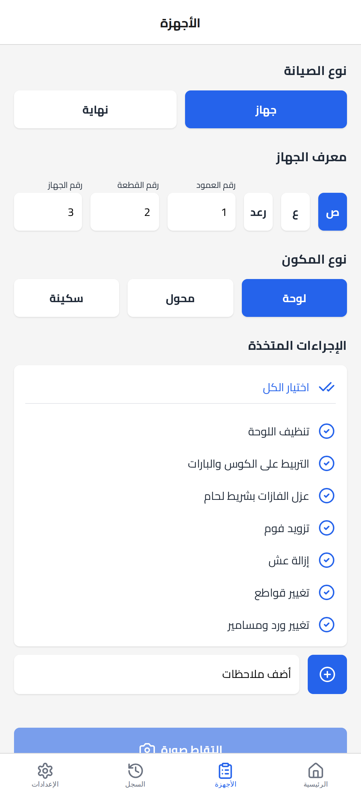
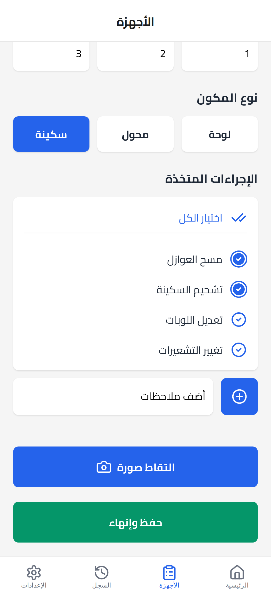
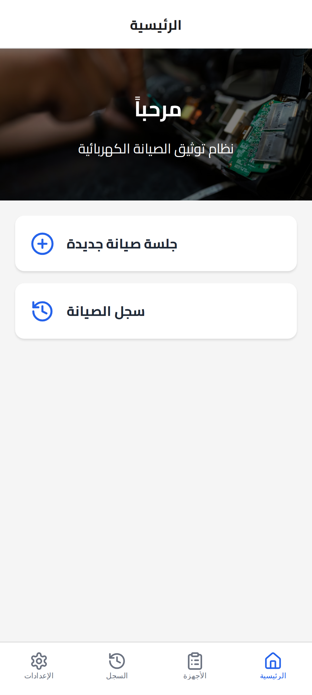
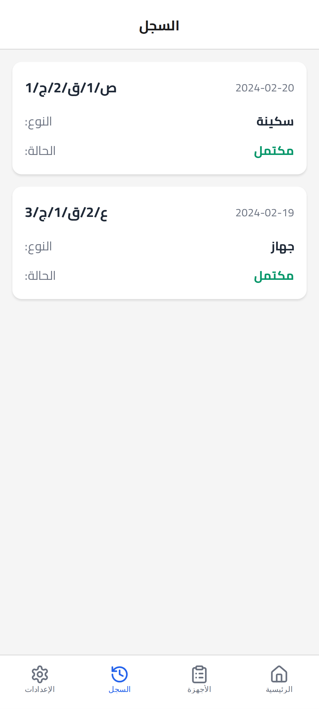
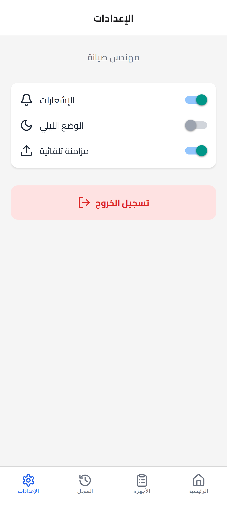

# Preventive Maintenance — Mobile App

> A React Native + TypeScript field-documentation app for electrical maintenance teams.
> Built solo to digitize and **standardize preventive-maintenance reporting** for
> medium-voltage equipment — replacing ad-hoc WhatsApp messages with structured,
> guided data entry.

<p>
  
  
  
  
  
  
</p>

[](https://stackblitz.com/github/aalsharkawi2/preventive-maintenance)

> Launches the **Expo web** build in your browser — great for exploring the UI and code.
> Native-only features (camera capture, saving to the photo library) need a device or
> emulator; see [Getting started](#getting-started).

---

## The problem

Maintenance engineers documented field work over **WhatsApp** — free-text messages and loose
photos. The result was inconsistent records, duplicated effort, and slow manual preparation of
the weekly preventive-maintenance reports. This app replaces that with a structured,
guided workflow so every session is captured the same way.

> **Note:** the production UI is **Arabic / right-to-left**. The screenshots below were
> captured from the running app (Expo web build).

## Screens

The core of the app is the **guided maintenance form** — pick the maintenance and component
type, enter the device identifier, then check off the actions taken.

| Maintenance form — device identifier | Maintenance form — actions taken |
|:---:|:---:|
|  |  |

| Home & Navigation | History Log | Settings |
|:---:|:---:|:---:|
|  |  |  |

## Workflow

```
Login → Home → Maintenance Form → Camera → Crop Editor → Save & Complete
                                                          ( + History & Settings tabs )
```

Expo Router file-based routing: an authenticated flow, four bottom-tab screens, and two
full-screen modals.

## Feature highlights

- **File-based navigation** — auth flow, four bottom-tab screens, and two full-screen
  modals wired with Expo Router.
- **Right-to-left Arabic UI** — Cairo typography and fully mirrored, RTL-aware layouts
  across every screen.
- **Guided maintenance forms** — cascading equipment selectors (location and
  identification codes) that auto-compute a device-identifier string, with auto-focus
  keyboard navigation, predefined action templates, and custom notes per equipment type.
- **Camera & image editing** — in-app capture, gallery import, and an interactive crop
  editor with full permission handling, plus capture guidance to keep component photos
  consistent and report-ready.
- **Reusable typed components** — generic TypeScript components (selectors, checklist
  items, note inputs) and a custom hook that centralizes the multi-step form's state,
  computed values, and reset logic.
- **State & accessibility** — Redux Toolkit for global app/auth state, keyboard-aware
  scrolling, and accessibility roles throughout.

## Tech stack

| Area | Tools |
|---|---|
| Framework | React Native 0.81, Expo 54, React 19 |
| Navigation | Expo Router 6, React Navigation 7 |
| Language | TypeScript 5.9 |
| State | Redux Toolkit, custom React hooks |
| Camera / images | expo-camera, expo-image-picker, expo-image-manipulator, expo-media-library |
| UI / motion | react-native-reanimated, lucide-react-native, @expo/vector-icons, expo-blur, expo-linear-gradient |
| Typography | @expo-google-fonts/cairo |
| Keyboard | react-native-keyboard-controller |

## Project structure

```
app/                 # Expo Router routes
  (auth)/login       # authentication entry
  (app)/(tabs)/      # home, devices (maintenance form), history, settings
  (modals)/          # camera, image-editor
components/          # reusable typed UI components
hooks/               # useMaintenanceState, useSystemUI, …
store/               # Redux Toolkit (auth slice)
types/               # shared TypeScript data models
styles/              # shared style tokens
```

## Getting started

```bash
# 1. Install dependencies
yarn install

# 2. Start the Expo dev server
npx expo start

# Then press: a (Android) · i (iOS) · w (web)
```

Requires Node.js 18+ and the [Expo](https://docs.expo.dev/) toolchain. For a native Android
build, an Android SDK / emulator is needed.

## Roadmap

The current build is the front-end and data layer. Designed and modeled, but not yet
implemented:

- Offline-first persistence and cloud sync of maintenance sessions.
- Backend integration and automated generation of weekly preventive-maintenance reports.
- Image rotation in the editor; configurable settings (dark mode, notifications, auto-sync).

## Author

**Ahmad ash-Sharkawi** — [github.com/aalsharkawi2](https://github.com/aalsharkawi2) ·
[linkedin.com/in/ash-sharkawi](https://www.linkedin.com/in/ash-sharkawi/)

Built solo as a front-end portfolio project.
